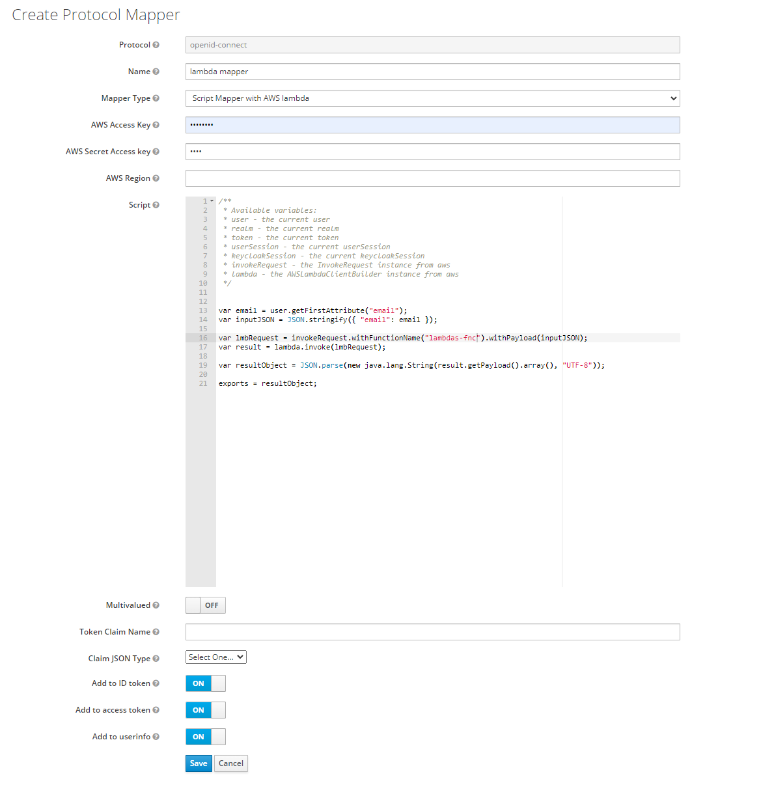

## Keycloack plugin: Mapper api

_Adds new script-based mapper functionality with native functions for aws lambda_



## Instalation

`docker cp keycloak-mapper-aws-lambda-script-1.0-SNAPSHOT.jar keycloack:/opt/jboss/keycloak/standalone/deployments/`

## Code example

```javascript
/**
 * Available variables:
 * user - the current user
 * realm - the current realm
 * token - the current token
 * userSession - the current userSession
 * keycloakSession - the current keycloakSession
 * invokeRequest - the InvokeRequest instance from aws
 * lambda - the AWSLambdaClientBuilder instance from aws
 */

var email = user.getFirstAttribute("email");
var inputJSON = JSON.stringify({ email: email });

var lmbRequest = invokeRequest
  .withFunctionName("lambdas-fnc")
  .withPayload(inputJSON);
var result = lambda.invoke(lmbRequest);

var resultObject = JSON.parse(
  new java.lang.String(result.getPayload().array(), "UTF-8")
);

exports = resultObject;
```

## Reference

https://github.com/keycloak/keycloak/blob/main/services/src/main/java/org/keycloak/protocol/oidc/mappers/ScriptBasedOIDCProtocolMapper.java
